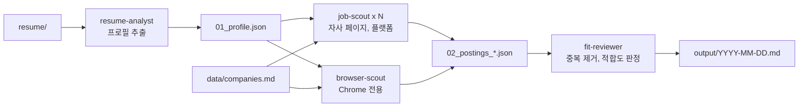

# job-fit-harness

이력서를 넣으면 연차와 직무에 맞는 채용공고를 찾아 마크다운 리포트 한 장으로 정리하는 Claude Code 하네스입니다.

대상은 대기업과 중견기업, IT 네임밸류 기업, 유니콘입니다. 네카라쿠배당토직야와 몰두센이 기본으로 들어 있고 `data/companies.md`에서 고칠 수 있습니다.

## 사용법

1. `resume/` 폴더에 이력서를 넣습니다. PDF와 md, txt를 읽습니다.
2. Claude Code를 Chrome 연동과 함께 켭니다. Cloudflare에 막히는 사이트(잡플래닛)와 JS로만 그려지는 채용 페이지를 읽을 때 씁니다. 연동 없이 켜도 그 몫만 빠지고 나머지는 동작합니다.
   ```bash
   claude --chrome
   ```
3. 요청합니다.
   ```
   채용공고 찾아줘
   ```

결과는 `output/YYYY-MM-DD.md`에 저장됩니다.

후속 요청도 같은 하네스가 받습니다. "토스만 다시 찾아줘", "링크드인 결과만 다시", "리포트만 다시 써줘", "이력서 바꿨어 다시 돌려줘"처럼 말하면 필요한 단계만 다시 돌립니다.

### 희망 조건 (선택)

이력서만으로 정할 수 없는 조건은 `resume/preferences.md`에 적습니다. 형식은 자유이고 이력서보다 우선합니다.

```markdown
- 희망 직무: 프론트엔드, 웹 플랫폼
- 연차: 5년 (이력서 계산값 대신 이 값을 쓴다)
- 근무지: 서울, 판교
- 제외: 현 직장, SI 성격 포지션
- 추가로 볼 기업: 리벨리온
```

## 탐색 순서

같은 공고가 여러 곳에 올라와 있으면 위쪽 출처의 링크를 씁니다. 수집은 병렬로 돌고, 순서는 중복을 합칠 때와 링크를 고를 때 적용됩니다.

1. **자사 채용 페이지**: 그리팅, 나인하이어, Lever, Greenhouse 같은 ATS 페이지를 포함합니다. 마감 여부와 자격요건이 가장 정확합니다.
2. **채용 플랫폼**: 원티드, 리멤버, 잡플래닛, 사람인, 직행, 점핏, 잡코리아, 캐치. 레지스트리에 없는 기업을 찾는 데 씁니다. 직행은 자사 채용 페이지에서 직접 모은 공고만 씁니다.
3. **링크드인**: 외국계와 글로벌 포지션을 보완합니다.

레지스트리 밖에서 찾은 기업은 대기업 계열사나 기업가치 1조 원 이상 유니콘으로 확인될 때만 리포트에 넣습니다. 상장사라는 이유만으로는 넣지 않습니다.

## 동작 방식



| 단계   | 에이전트              | 하는 일                                                                                                                              |
| ------ | --------------------- | ------------------------------------------------------------------------------------------------------------------------------------ |
| 프로필 | `resume-analyst`      | 이력서에서 연차, 직무, 핵심 기술, 검색어를 뽑습니다. 이름과 연락처는 옮기지 않습니다.                                                |
| 수집   | `job-scout` 여러 개   | 레지스트리를 17곳 안팎씩 최대 7개로 나눠 병렬로 자사 페이지를 읽습니다. 한 개는 플랫폼 검색과 ATS 도메인 검색을 맡습니다.            |
| 수집   | `browser-scout` 한 개 | JS로만 그려지고 API도 없는 채용 페이지와 잡플래닛을 Chrome으로 읽습니다. 읽으면서 찾은 JSON API는 레지스트리 수정 제안으로 남깁니다. |
| 판정   | `fit-reviewer`        | 중복을 합치고 연차와 직무, 기술로 걸러 리포트를 씁니다.                                                                              |

Chrome 작업을 에이전트 하나에 몰아 둔 이유는 브라우저 하나를 여러 에이전트가 동시에 조작하면 탭 포커스와 스크린샷이 서로 엉키기 때문입니다. `job-scout`는 Chrome 도구를 아예 받지 않습니다.

## 결과물

리포트에는 지원 판단에 필요한 것만 넣습니다.

```markdown
# 채용공고 2026-10-07

프론트엔드 경력 5.3년 기준. 기업 120곳 확인, 공고 14건 (신규 5건)

## 추천

| 티어 | 기업 | 포지션                             | 경력     | 마감 | 맞는 이유          | 링크                |
| ---- | ---- | ---------------------------------- | -------- | ---- | ------------------ | ------------------- |
| S    | 토스 | 신규 Frontend Developer (Payments) | 3년 이상 | 상시 | React, 결제 도메인 | [자사](https://...) |

## 검토

| 티어 | 기업 | 포지션 | 경력 | 마감 | 걸리는 점 | 링크 |
| ---- | ---- | ------ | ---- | ---- | --------- | ---- |

## 확인 못 한 곳

두나무 (페이지 오류), 잡플래닛 (Chrome 미연결)
```

- **추천**: 직무가 맞고 연차가 요건 안에 있으며 핵심 기술이 두 개 이상 겹칩니다.
- **검토**: 직무가 인접하거나 연차가 요건 경계에 있습니다. 무엇이 걸리는지 적습니다.
- **신규**: 직전 리포트에 없던 공고입니다.

다음 공고는 리포트에 넣지 않습니다.

- 헤드헌팅이나 서치펌 공고, 회사명을 가린 공고
- 파견, 도급, 고객사 상주 근무
- 계약직, 인턴, 아르바이트, 프리랜서. `preferences.md`에 허용한다고 적으면 남깁니다.
- 레지스트리 밖 기업 중 대기업 계열사나 기업가치 1조 원 이상 유니콘으로 확인되지 않는 곳, 최근 1년 안에 회생이나 임금 체불 보도가 있는 곳

제외한 공고와 이유는 `_workspace/04_dropped.md`에 남습니다. 원하는 공고가 빠졌으면 여기서 이유를 확인하세요.

## 폴더 구조

```
job-fit-harness/
├── README.md
├── CLAUDE.md                      하네스 트리거
├── .claude/
│   ├── settings.json              웹 검색, 웹 읽기, curl, Chrome 권한
│   ├── agents/
│   │   ├── resume-analyst.md
│   │   ├── job-scout.md
│   │   ├── browser-scout.md
│   │   └── fit-reviewer.md
│   └── skills/
│       ├── job-hunt/              오케스트레이터
│       ├── resume-profiling/      이력서에서 프로필 뽑는 법
│       ├── job-collection/        출처별 공고 수집법
│       │   └── references/        자사 페이지 읽는 법, 플랫폼 읽는 법
│       └── fit-report/            적합도 기준과 리포트 형식
├── data/
│   └── companies.md               대상 기업 레지스트리
├── resume/                        이력서 (git 제외)
├── output/                        리포트 (git 제외)
└── _workspace/                    중간 산출물 (git 제외)
```

`.claude/agents/`는 누가 하는지, `.claude/skills/`는 어떻게 하는지를 담습니다. 에이전트는 작업을 시작할 때 자기 스킬 파일을 읽습니다.

## 기업 레지스트리

`data/companies.md`는 분류별 표입니다. 리포트는 `티어` 열 순서(S, A+, A, B+, B, 빈칸)로 정렬되고, 같은 티어 안에서는 표의 행 순서를 따릅니다.

| 열          | 뜻                                                                                                                                                               |
| ----------- | ---------------------------------------------------------------------------------------------------------------------------------------------------------------- |
| 티어        | 지원 우선순위. 비워 두면 맨 뒤로 갑니다                                                                                                                          |
| 채용 페이지 | 공고 목록이 보이는 URL                                                                                                                                           |
| ATS         | 자체, greetinghr, ninehire, lever, greenhouse 등                                                                                                                 |
| 접근        | `fetch`는 HTML에 공고가 있음, `api`는 공개 JSON이 있음, `browser`는 JS 렌더링이 필요함, `login`은 로그인이 필요함, `group`은 그룹 통합 사이트 행에서 함께 수집함 |
| 비고        | 수집에 쓰는 식별자와 거르는 조건                                                                                                                                 |

기업을 추가할 때는 이름과 채용 페이지만 적어도 됩니다. 접근 방식을 비워 두면 `job-scout`가 먼저 시도하고 안 되면 `browser-scout`로 넘깁니다. 수집 중에 바뀐 URL을 발견하면 실행이 끝날 때 레지스트리 수정을 제안합니다. 승인한 것만 반영합니다.

회생이나 파산, 합병으로 뺀 기업은 맨 아래 "제외한 기업" 절에 이유와 확인일을 남깁니다. 이 절은 수집 대상이 아닙니다.

## MCP

추가 MCP 서버 없이 동작합니다. `.mcp.json`도 두지 않았습니다.

- 웹 검색과 페이지 읽기는 Claude Code 내장 `WebSearch`, `WebFetch`를 씁니다.
- 공개 JSON API는 `curl`과 `jq`로 읽습니다.
- 브라우저는 Claude in Chrome 확장을 씁니다. MCP 설정 파일이 아니라 `claude --chrome` 또는 세션 안의 `/chrome`으로 켭니다. Cloudflare 확인을 통과해야 하는 잡플래닛을 이것으로 읽습니다. 링크드인과 리멤버는 로그인 없이 열리는 API로 읽어서 Chrome이 필요 없습니다.

Chrome 없이 무인으로 돌리면서 browser-scout 몫까지 읽어야 할 때만 Playwright MCP(`@playwright/mcp`)를 추가하면 됩니다.

## 주의

- 이력서와 리포트, 중간 산출물은 `.gitignore`로 커밋에서 빠집니다. 리포트를 저장소에 남기려면 `.gitignore`에서 `output/`을 지우세요.
- `browser-scout`는 내 Chrome으로 접속합니다. 짧은 시간에 많은 페이지를 열지 않도록 페이지를 순서대로 하나씩 엽니다.
- 공고는 수집 시점 기준입니다. 지원 전에 링크에서 마감 여부를 확인하세요.
